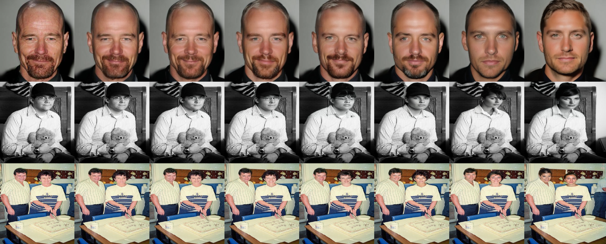
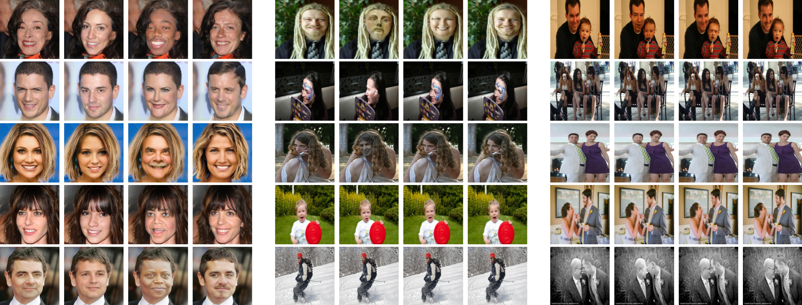
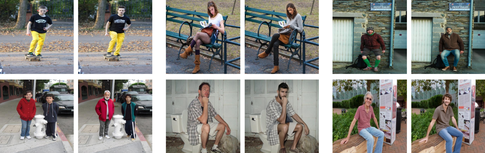
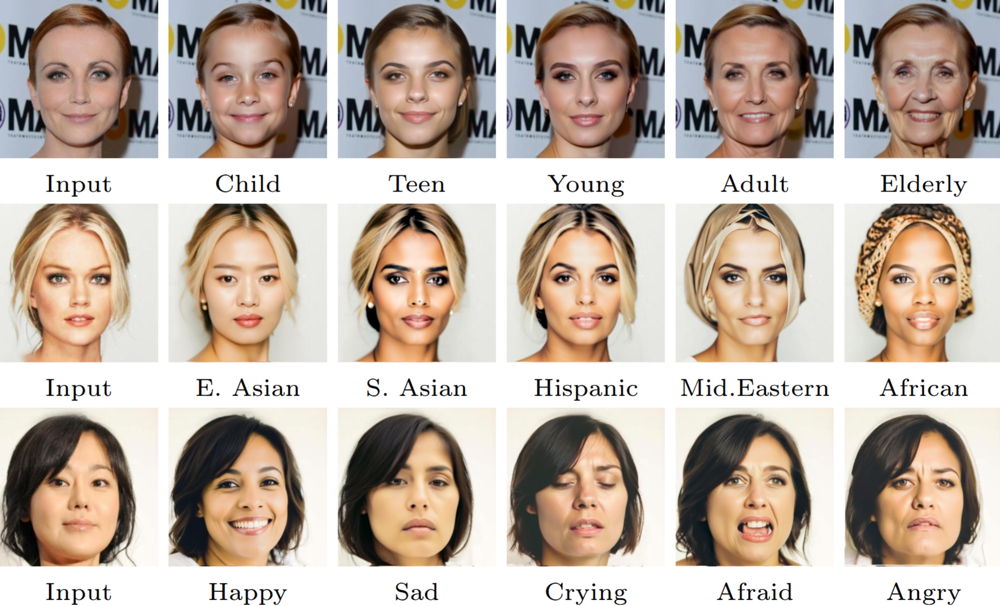
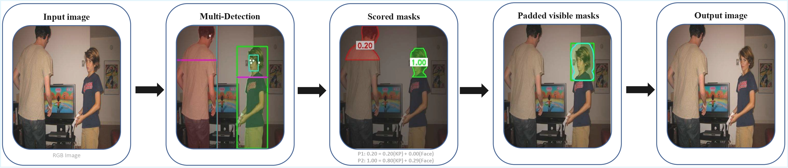

# Visibility-Aware Diffusion-Based Face Anonymization for Real-World Deployment

[](#)
[](LICENSE)
[](https://www.python.org/)

> Accepted at **ICPR 2026**. A production-ready face anonymization pipeline combining visibility-aware filtering with diffusion-based inpainting, designed for real-world scenarios with multiple people, extreme scale variations, occlusions, and diverse conditions.

---

## Why this work?

State-of-the-art anonymization methods are optimized for curated datasets: pre-cropped, aligned, single faces under controlled conditions. They process every detected face indiscriminately, wasting computation on low-confidence detections and producing artifacts on barely-visible faces.

We address this with two key ideas:
- **Visibility scoring**: only process faces a human could actually identify
- **Model-agnostic pipeline**: swap the generative backbone without redesigning the system

---

## Results

### Adjustable anonymization strength (0.3 → 0.9)



*Each row shows the original image and anonymization outputs at increasing strength. From close-up portraits to distant two-person scenes.*

---

### Real-world generalization



*Columns: Original | DeepPrivacy2 | FAMS | Ours. Rows: close-up portraits (CelebA-HQ), multi-scale scenes (COCO), multi-person groups (COCO).*

---

### Full-body anonymization



*The same pipeline handles full-body anonymization via a single flag in `config.py`, with no retraining needed.*

---

### Text-guided attribute control



*Age, ethnicity, and emotion controlled through natural language prompts.*

---

## Key results

Utility preservation on real-world COCO scenes: the primary deployment target:

| Metric | DeepPrivacy2 | FAMS | **Ours** |
|---|---|---|---|
| Face detection rate (↑) | 94.2% | 84.0% | **98.0%** |
| Face count preservation (↑) | 94.4% | 90.6% | **99.7%** |
| Gender accuracy (↑) | 74.8% | 72.8% | **87.2%** |
| Age MAE in years (↓) | 4.8 | 4.7 | **4.7** |

---

## Pipeline



1. **Person detection**: YOLOv11n
2. **Face detection + visibility scoring**: DeepFace (RetinaFace backend) + YOLO-pose (5 facial keypoints)
3. **Filtering**: faces with score ≤ 0.40 are skipped
4. **Adaptive mask generation**: segmentation-based with multi-tier elliptical fallback
5. **Inpainting**: Stable Diffusion XL inpainting on expanded head crops
6. **Compositing**: soft alpha blending back onto the original image

---

## Repository structure

```
├── src/
│   ├── config.py          # All constants: paths, thresholds, prompts, model params
│   ├── utils.py           # Image file discovery across supported formats
│   ├── visibility.py      # Face detection (DeepFace) + keypoint scoring (YOLO-pose)
│   ├── masking.py         # Person segmentation, head mask extraction, dilation
│   ├── inpainting.py      # SDXL inpainting on expanded head crops
│   ├── compositing.py     # Alpha blending of inpainted crops onto original image
│   └── pipeline.py        # Orchestrator: model loading and batch processing
├── eval/
│   ├── quality_test.py    # LPIPS and FID on face crops
│   ├── similarity_test.py # ArcFace cosine similarity (identity removal)
│   └── utility_test.py    # Detection rates, gender accuracy, age MAE
├── images/                # Figures for README
├── requirements.txt
└── README.md
```

**Design decisions:**
- Models are instantiated once in `pipeline.py` and injected as arguments: no global state
- All inpaintings are computed from the original image before any compositing: no compounding artifacts
- Private helpers prefixed with `_` throughout

---

## Installation

```bash
git clone https://github.com/MJLahgazi/vis-aware-diffusion-anonymization
cd vis-aware-diffusion-anonymization
pip install -r requirements.txt
```

**Dependencies:** `ultralytics`, `diffusers`, `deepface`, `torch`, `torchvision`, `opencv-python`, `lpips`, `scipy`, `pandas`, `matplotlib`, `tqdm`, `Pillow`

---

## Models

**YOLO models** (`yolo11n.pt`, `yolo11n-seg.pt`, `yolo11n-pose.pt`) download automatically via `ultralytics` on first run.

**SDXL inpainting** (`diffusers/stable-diffusion-xl-1.0-inpainting-0.1`) downloads automatically via HuggingFace Diffusers but requires authentication:

```bash
huggingface-cli login
```

A free HuggingFace account is sufficient.

---

## Usage

**1. Configure paths and parameters in `src/config.py`:**

```python
INPUT_FOLDER  = "input_images"   # folder containing images to anonymize
OUTPUT_FOLDER = "output"         # folder for anonymized outputs

INPAINT_STRENGTH    = 0.45       # 0.3 subtle → 0.9 dramatic
ANONYMIZE_FULL_BODY = False      # set True for full-body anonymization
```

**2. Run:**

```bash
python src/pipeline.py
```

The pipeline processes all images in `INPUT_FOLDER` and writes results to `OUTPUT_FOLDER`. A folder containing a single image is processed as a one-image batch.

---

## Configuration guide

All parameters are centralized in `src/config.py`:

| Parameter | Default | Description |
|---|---|---|
| `VISIBILITY_THRESHOLD` | 0.40 | Faces below this score are skipped |
| `INPAINT_STRENGTH` | 0.45 | Anonymization intensity |
| `ANONYMIZE_FULL_BODY` | False | Head-only vs full-body inpainting |
| `GUIDANCE_SCALE` | 7.0 | Diffusion guidance scale |
| `NUM_INFERENCE_STEPS` | 50 | Diffusion inference steps |
| `POSITIVE_PROMPT` | see config | Controls generated appearance |
| `NEGATIVE_PROMPT` | see config | Suppresses unwanted artifacts |

**Inpainting strength guide:**
- `0.3 – 0.4`: subtle modifications, demographic attributes preserved
- `0.5 – 0.6`: balanced privacy and utility
- `0.7 – 0.9`: strong anonymization, maximum identity removal

---

## Evaluation

Three evaluation scripts are provided in `eval/`, reproducing the paper's quantitative results:

- `quality_test.py`: LPIPS and FID (perceptual quality)
- `similarity_test.py`: ArcFace cosine similarity (identity removal strength)
- `utility_test.py`: detection rates, gender accuracy, age MAE (downstream utility)

Each script compares our method against DeepPrivacy2 and FAMS (see the paper for full details) on COCO images. 

Reproducing Tables 2, 3, and 4: the exact input samples, sample manifests, and generated outputs (ours, DeepPrivacy2, FAMS) used to produce these tables are available at huggingface.co/datasets/med-jaouad/vis-aware-anonymization-eval.

---

## Model-agnostic design

Computational efficiency scales with the chosen backbone. The pipeline imposes no constraint on which inpainting model is used. Lighter alternatives such as SDXL-Turbo or distilled variants can be substituted in `pipeline.py` without any other changes.

---

## Citation

```bibtex
@inproceedings{lahgazi2026visaware,
  title        = {Visibility-Aware Diffusion-Based Face Anonymization for Real-World Deployment},
  author       = {Lahgazi, Mohamed Jaouad and Tarel, Jean-Philippe},
  booktitle    = {International Conference on Pattern Recognition (ICPR)},
  year         = {2026},
  organization = {Springer}
}
```

---

## License

This project is licensed under the MIT License. See [LICENSE](LICENSE) for details.
